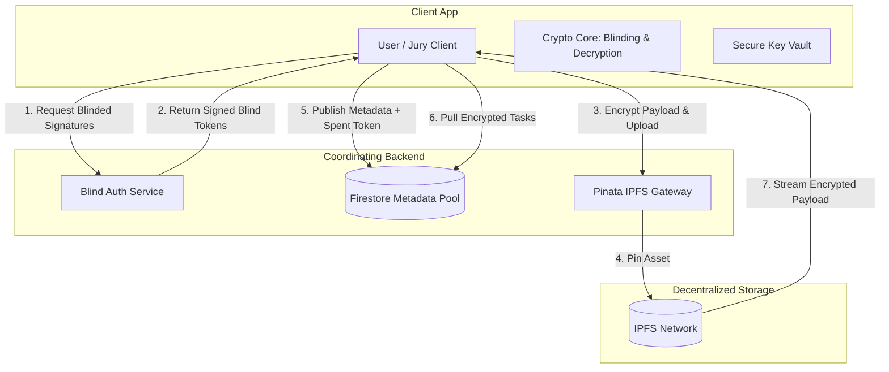
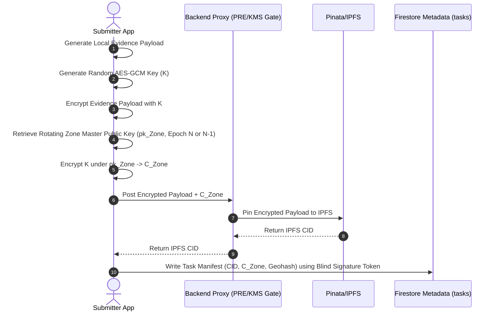
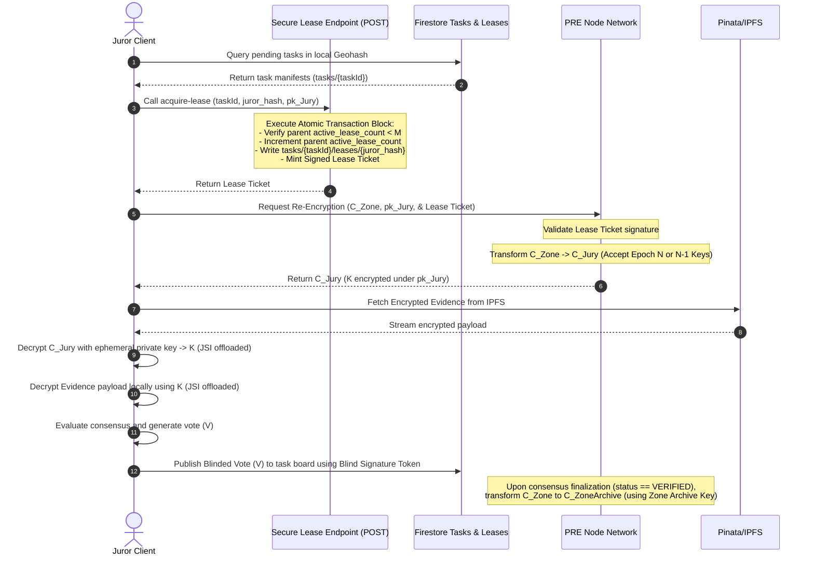

# Brone Architecture Blueprint: Decentralized, Zero-Trace Localized Information Network

This blueprint defines the architecture, directory structure, and cryptographic primitives for **Brone**, a zero-trace, privacy-first localized information network. The system allows users to securely verify local occurrences, submit geofenced evidence, and participate in peer-jury consensus without leaving any linkable traces or exposing personal identifiers.

---

## 1. Core Architectural Primitives

Brone decouples authentication, coordination, and compensation to enforce complete unlinkability. Below are the cryptographic protocols that power these pillars.



### 1.1 Blind Authentication (Privacy Pass / RSA Blind Signatures)
To prevent the system from linking a user's location-based verification with their subsequent submissions or votes, Brone utilizes **RSA Blind Signatures** (similar to the Privacy Pass protocol).

*   **Registration Phase (Locality Gate):** The client presents proof of locality (e.g., GPS coordinates verified via cryptographic location signatures). Once verified, the server allows the client to obtain a set of blind signature tokens.
*   **The Blinding Protocol:**
    1.  The client generates a random message $x$ and a secret blinding factor $r$.
    2.  The client computes the blinded message $T = x \cdot r^e \pmod N$, where $(e, N)$ is the server's public key.
    3.  The server signs the blinded message: $S' = T^d \pmod N$, where $d$ is the server's private key.
    4.  The server returns $S'$ to the client.
    5.  The client unblinds $S'$ by calculating $S = S' \cdot r^{-1} \pmod N$. The pair $(x, S)$ represents a valid signature on $x$ that can be verified using the server's public key, yet the server cannot associate $x$ with the session in which it was signed.
*   **Redemption Phase:** When posting a report or submitting a consensus vote, the client presents $(x, S)$ to the server. The server verifies the signature and checks a **Double-Spend Registry** in Firestore to ensure $x$ has not been redeemed before. Once validated, the action is committed.

### 1.2 Pull-Based Jury Matching (with Ephemeral Key Routing)
Instead of a central server assigning tasks to specific jury members (which creates a massive metadata vector and compromise risk), Brone uses a pull-based bulletin board.

*   **Ephemeral Key Registration:** Jury members generate ephemeral Elliptic Curve Diffie-Hellman (ECDH) key pairs for specific geographic sectors (represented as Geohashes) and upload their ephemeral public keys to a Firestore coordination directory.
*   **Task Encryption and Post Lifecycle Separation (Active Dispute vs. Archived Feed):**
    To protect data while in dispute and optimize decryption performance when archived, Brone separates the cryptographic state of posts based on their lifecycle status:
    1.  **Active Dispute State (PENDING Jury Phase):** The client encrypts the raw evidence payload with $K$ (AES-GCM). It encrypts $K$ under a rotating **Zone Master Public Key** ($pk_{Zone}$) corresponding to the regional Geohash and current epoch $N$: $C_{Zone} = \text{Encrypt}_{pk_{Zone}}(K)$. While the post is `PENDING`, the rotating Zone Master Key is used exclusively to control jury access.
    2.  **Proxy Re-Encryption Transformation for Jurors:** When an authorized juror pulls a task, the decentralized PRE node network uses the juror's ephemeral public key $pk_{Jury}$ and the active zone private key $sk_{Zone}$ to compute $C_{Jury} = \text{ReEncrypt}(C_{Zone}, rk_{Zone \to Jury})$ without decrypting $K$.
    3.  **Archived Feed State (VERIFIED Phase):** Upon successful consensus finalization (status transitions to `VERIFIED`), the PRE network (or KMS) executes a one-time final cryptographic transformation on the database. It re-encrypts the payload's encrypted symmetric key $C_{Zone}$ to a stable, long-term **Zone Archive Public Key** ($pk_{ZoneArchive}$).
    4.  **Optimized Client Feed Rendering:** When displaying the public home feed (where posts are already verified), the client app decrypts posts using the stable regional archive key ($pk_{ZoneArchive}$) cached or derived for that geohash zone. This eliminates the requirement for the mobile client to fetch and process unique multi-epoch key slices or register ephemeral keys for individual historical posts during layout scrolling, maintaining smooth rendering performance.
*   **IPFS Upload:** The heavily encrypted evidence payload is uploaded to IPFS via a Pinata proxy.
*   **The Pull Process:** Jury clients continuously monitor the Firestore `task_board` for metadata matching their registered geohashes. When a matching metadata entry is found, the jury member pulls the encrypted evidence from IPFS and decrypts it locally using their ephemeral private key. No server knows which jury client decrypted which task.

#### **Jury Concurrency Lock Protocol (Atomic Transaction Block Reservation)**
To eliminate race conditions, double allocation, and split-verification vulnerabilities (where security rules and cloud function execution are decoupled), Brone mandates a single, unified database transaction block:
1.  **Unified Backend Reservation Endpoint:** Juror clients claim a task by calling a secure API endpoint `POST /tasks/{taskId}/acquire-lease`, passing their `ephemeral_juror_hash` and `ephemeral_public_key`.
2.  **Atomic Transaction Execution:** Inside a single, isolated database transaction block:
    - The backend reads the parent document `tasks/{taskId}`.
    - It verifies that the `active_lease_count` is strictly less than $M$ (e.g., $M = 3$ concurrent slots).
    - It verifies that the juror's lease document path `tasks/{taskId}/leases/{ephemeral_juror_hash}` does not already exist with an active lease.
    - It increments `active_lease_count` in the parent document.
    - It writes the lease document directly to the sub-collection path `tasks/{taskId}/leases/{ephemeral_juror_hash}`.
    - It generates and signs a cryptographically verifiable **Lease Ticket** containing `{"taskId": taskId, "juror_hash": ephemeral_juror_hash, "expires_at": timestamp}` signed by the backend private key.
3.  **Collision-Free Isolation:** Executing the parent count check, parent field increment, and sub-collection document allocation in a single atomic database write transaction guarantees absolute state consistency and prevents transaction conflicts under high throughput.

### 1.3 Anonymous Reward Redemption: The Scratch-Card Protocol with Blind Batch Issuance
To reward users for accurate consensus voting or trusted reporting without linking their payout address to their network activities, Brone uses the **Scratch-Card Protocol** based on a Double-Blinded token framework (Privacy Pass / RSA Blind Signatures):

*   **Cryptographic Unlinkability & Blind Batch Issuance (Double-Blinded Model):**
    1.  **Contribution Credits:** When a task reaches consensus, the backend automatically increments a private "unspent contribution balance" in the verified juror's account document. This happens server-side, completely decoupled from any client-side payout request.
    2.  **Generation & Blinding:** The client generates a random seed $x$ and a blinding factor $r$. It computes a blinded token request $T = x \cdot r^e \pmod N$ (where $e, N$ is the reward issuer's public key).
    3.  **Blinded Stamping:** To collect their rewards, the user initiates a session and requests a voucher stamp. The server verifies *only* that the authenticated user possesses an unspent contribution balance $> 0$. If verified, it decrements the user's contribution balance by 1, signs the blinded token $T$ as $S' = T^d \pmod N$, and returns $S'$. The server does *not* record or pass any `taskId` or voting context during this signature handshake, eliminating any tracking link between specific tasks and the payout session.
    4.  **Unblinding:** The client unblinds the signature locally: $S = S' \cdot r^{-1} \pmod N$. The pair $(x, S)$ is a globally valid cryptographic signature on $x$ that verifies under the backend's public key.
    5.  **Redemption:** The client waits for an arbitrary delay, shifts network context (VPN/mixnet), and presents $(x, S)$ to the decoupled Reward Redemption endpoint along with a fresh anonymous payout address. The backend verifies the signature $S$ against the message $x$, checks that $x$ is not in the spent double-spend database, and dispatches the reward. Since the signer only saw the blinded token $T$ and the redeemer sees $(x, S)$, there is zero linkability between the session that earned the reward and the address that received it.

### 1.4 Zone Key Lifecycle Management
To ensure long-term localized data availability while protecting past communications, Brone manages geographic decryption keys in structured epochs:
*   **Epoch-Based Derivation & Overlap Buffer Window:**
    Rotating Zone Master Key pairs ($sk_{Zone}, pk_{Zone}$) are generated and rotated per geographic Geohash sector at fixed intervals (e.g., 24-hour windows, denoted by `epoch_id`).
    To handle distributed clock drift and latency during rotation boundaries, the database schemas, client multi-epoch caches, and PRE network nodes implement a 2-hour **Overlap Buffer Window**. During this window, key transformations and re-encryption tasks can be processed using both the active epoch (N) and the immediate past epoch (N-1) keys to prevent in-flight task failures.
*   **Historical Key Archival:**
    - When an epoch expires, the zone master public keys are archived in the `historical_zone_keys` collection in Firestore.
    - Ephemeral private keys corresponding to re-encryption keys are retained locally by the jury clients inside their secure vault for a grace window (e.g., 7 days) to settle outstanding jury tasks, after which they are permanently zeroized to guarantee forward secrecy.
*   **Multi-Epoch Client Cache:**
    - The client app manages an offline multi-epoch key database using Expo SQLite, mapping `[geohash_sector + epoch_id]` to the retrieved/generated public keys and locally retained private keys.
    - When a user browses historical feed posts, the client reads the `epoch_id` and `geohash` from the post metadata, searches its local multi-epoch cache, and applies the corresponding decryption key. If a key is missing locally (e.g., the user is new to that zone), the client fetches the matching archived key metadata to verify historical authenticity.

### 1.5 Resilient Client-Side Token State (Offline Outbox)
To protect in-flight cryptographic tokens (blinded request structures, signatures, and unblinded reward vouchers) from app termination, battery failure, or network drops, the Expo client employs a Write-Ahead Offline Outbox architecture:
*   **Local Secure Outbox Database (`local_token_outbox` via SQLite/SecureStore):**
    Every step of the token lifecycle is tracked in a local database transaction log before network transmission:
    ```sql
    CREATE TABLE local_token_outbox (
      id TEXT PRIMARY KEY,
      token_type TEXT CHECK(token_type IN ('AUTH_TOKEN', 'REWARD_VOUCHER')),
      state TEXT CHECK(state IN ('PENDING_BLINDING', 'BLINDED_SENT', 'UNBLINDED', 'REDEMPTION_SENT', 'SPENT')),
      blind_factor_r TEXT,             -- Encrypted at rest via keychain
      raw_message_x TEXT UNIQUE,
      blinded_message_T TEXT,
      signed_blinded_token_S_prime TEXT,
      unblinded_signature_S TEXT,
      retry_count INTEGER DEFAULT 0,
      last_attempted_at INTEGER
    );
    ```
*   **Outbox State Transitions:**
    - **Step 1: Write-Ahead Blinding Log:** Prior to sending a blinded message $T$ to the server, the client creates a record in the local DB in the `PENDING_BLINDING` state, preserving the private blinding factor $r$ and secret message $x$.
    - **Step 2: Network Handshake:** Upon dispatching the request, the state is updated to `BLINDED_SENT`. If the client crashes, a background sync manager reads the DB on startup and queries the server for the corresponding signature $S'$, avoiding duplicated blinding/token expenditure.
    - **Step 3: Atomic Unblinding:** Once $S'$ is retrieved, the client calculates $S = S' \cdot r^{-1}$, records the final unblinded signature $S$, updates the state to `UNBLINDED`, and securely overwrites the memory space containing the blinding factor $r$.
    - **Step 4: Redemption Outbox:** When redeeming a voucher or spent auth token, the outbox state transitions to `REDEMPTION_SENT`. It only marks the entry as `SPENT` once the backend completes metadata commitment and returns an authenticated confirmation receipt.


---

## 2. Decoupled Folder Structure

The project workspace is organized as a monorepo containing the mobile frontend, backend handlers, and shared packages. This separation ensures that cryptographic logic remains consistent between client and server.

```
brone/
├── apps/
│   ├── mobile/                      # Expo / React Native Client App
│   │   ├── app/                     # Expo Router Layouts & Routing
│   │   │   ├── _layout.tsx          # Root Layout with secure context providers
│   │   │   ├── index.tsx            # Anonymous Local Feed Screen
│   │   │   ├── jury.tsx             # Pull-Based Jury Decryption & Consensus Interface
│   │   │   ├── submit.tsx           # Geofenced Submission Screen (Pre-Blinding & IPFS Upload)
│   │   │   └── vault.tsx            # Local Cryptographic Key Management & Wallet
│   │   ├── src/
│   │   │   ├── components/          # Reusable UI Components (Glassmorphic, OLED Black theme)
│   │   │   │   ├── GlassCard.tsx    # Premium blurred visual container
│   │   │   │   ├── Decryptorux.tsx  # Interactive state/animation during local decryption
│   │   │   │   └── LocationGate.tsx # Geofencing verification helper
│   │   │   ├── crypto/              # Client-side cryptographic interfaces (All heavy mathematical operations, including RSA Blinding, ECIES envelope wrapping, and AES-GCM decryption, must be offloaded from the main JS thread using React Native JSI native hardware accelerated wrappers to maintain a non-blocking 60fps UI experience)
│   │   │   │   ├── blindSignatures.ts# RSA blinding, unblinding, and token local storage (JSI accelerated)
│   │   │   │   └── ephemeralKeys.ts # ECDH key generation, storage, and shared secret derivation (JSI accelerated)
│   │   │   ├── hooks/               # Custom React Hooks
│   │   │   │   ├── useFirestorePool.ts# Read/write hooks for Firestore metadata registries
│   │   │   │   └── useIPFSPayload.ts  # Fetching and local streaming decryption from IPFS
│   │   │   └── services/            # API wrappers and local hardware interfaces
│   │   │       ├── secureStore.ts   # Secure hardware storage wrapper (Expo SecureStore)
│   │   │       └── firestoreSvc.ts  # Core Firestore metadata interaction client
│   │   ├── package.json
│   │   └── tsconfig.json
│   │
│   └── backend/                     # Node.js Backend Services (Firebase Cloud Functions)
│       ├── src/
│       │   ├── middleware/          # Server security interceptors
│       │   │   ├── verifyBlindAuth.ts# RSA public key verification against Double-Spend Registry
│       │   │   └── verifyLocality.ts # Geofencing cryptographic verification
│       │   ├── services/            # Infrastructure interfaces
│       │   │   ├── firestoreAdmin.ts# Privileged Firestore read/write operations
│       │   │   └── pinataStorage.ts # Secure IPFS pinning proxy
│       │   ├── controllers/         # Endpoint business logic
│       │   │   ├── authController.ts# Handles RSA blind signature signing requests
│       │   │   ├── taskController.ts# Generates task manifests and encrypts metadata indices
│       │   │   └── rewardController.ts# Validates reward vouchers and dispatches payouts
│       │   └── index.ts             # Server entry point / Cloud Functions exports
│       ├── package.json
│       └── tsconfig.json
│
├── packages/                        # Shared Workspace Packages
│   ├── crypto-core/                 # Platform-Agnostic Cryptographic Logic
│   │   ├── src/
│   │   │   ├── rsaBlind.ts          # Core math for RSA blind signatures
│   │   │   ├── ecies.ts             # Ephemeral ECIES encryption/decryption routines
│   │   │   └── index.ts
│   │   ├── package.json
│   │   └── tsconfig.json
│   │
│   └── types/                       # Shared TypeScript Interfaces
│       ├── src/
│       │   ├── firestore.d.ts       # Strictly typed Firestore schemas
│       │   ├── ipfs.d.ts            # Structures for Pinata payload manifests
│       │   └── index.ts
│       ├── package.json
│       └── tsconfig.json
│
├── package.json                     # Monorepo Workspace Configuration
└── architecture_blueprint.md        # This blueprint document
```

---

## 3. Storage and Database Schema Integration

The system maintains a absolute boundary: **Firestore holds lightweight, public, or ephemeral metadata**, while **Pinata/IPFS holds heavy, encrypted payloads**.

### 3.1 Firestore Schema Layout

#### `blind_auth_keys` (Collection)
Stores public parameters used by clients to blind authorization messages.
```json
{
  "key_id": "rsa-2026-v1",
  "modulus_n": "0xAB823B...",
  "exponent_e": "65537",
  "created_at": 1779234580,
  "expires_at": 1781826580
}
```

#### `double_spend_registry` (Collection)
Stores cryptographic hashes of spent unblinded authentication tokens to prevent reuse.
```json
{
  "token_hash": "sha256-4f8a3c9e...",
  "spent_at": 1779248900
}
```

#### `historical_zone_keys` (Collection)
Archives expired zone master public keys to enable historical validation of older feed posts.
```json
{
  "epoch_id": "epoch-2026-05-20",
  "geohash_sector": "tttf4h",
  "zone_master_public_key": "04B2C3D4...",
  "overlap_buffer_expires_at": 1779252000,
  "archived_at": 1779244800
}
```

#### `zone_archive_keys` (Collection)
Stores stable long-term regional archive public keys used for high-performance public feed rendering.
```json
{
  "geohash_sector": "tttf4h",
  "zone_archive_public_key": "04C3D4E5...",
  "created_at": 1779234580
}
```

#### `tasks` (Collection)
Contains metadata manifests pointing to encrypted evidence payloads on IPFS and references to the re-encryption context.
```json
{
  "task_id": "uuid-8894-4d2a",
  "geohash_sector": "tttf4h",
  "ipfs_cid": "QmXoypizjW3WknFiJnKLwHCnL72vedxjQkDDP1mXWo6uco",
  "encrypted_symmetric_key": "aes-key-encrypted-under-zone-master-key-C_zone",
  "epoch_id": "epoch-2026-05-20",
  "status": "pending",
  "active_lease_count": 0,
  "created_at": 1779242000
}
```

#### `tasks/{taskId}/leases` (Sub-Collection Isolation)
Handles individual concurrent juror lock reservations mapping directly to the active slot pool.
```json
{
  "ephemeral_juror_hash": "sha256-e9a8f4...",
  "leased_at": 1779242100,
  "expires_at": 1779242700,
  "ephemeral_public_key": "04A1B2C3...",
  "lease_ticket": "signature-validating-atomic-allocation"
}
```

### 3.2 Storage Mapping (Pinata/IPFS Payload Structure)
The encrypted file stored on IPFS has the following schema:
```json
{
  "version": "1.0.0",
  "iv": "hex-encoded-initialization-vector",
  "auth_tag": "hex-encoded-gcm-authentication-tag",
  "encrypted_payload": "base64-encoded-evidence-data",
  "metadata": {
    "content_type": "application/json",
    "encrypted_at": 1779241900
  }
}
```

---

## 4. End-to-End Cryptographic Flow Sequences

### 4.1 Client Submission Flow


### 4.2 Distributed Pull-Queue Verification & Proxy Re-Encryption


In Step 5 of the sequence diagram, the Juror Client requests re-encryption from the Proxy Re-Encryption (PRE) Node Network. To prevent unauthorized data-scraping and malicious key transformation requests, the Juror Client must attach the cryptographically signed **Lease Ticket** obtained during the lock acquisition phase. The PRE Node Network validates this ticket signature before proceeding with the threshold re-encryption operation, ensuring that only authorized, leased jurors can access re-encrypted key packets. During the rotation window, key transformations can utilize both the active epoch $N$ keys and the immediate past epoch $N-1$ keys under the Overlap Buffer Window protocol. Upon successful verification consensus, the PRE network executes a final transformation, re-encrypting the payload key to the stable, long-term **Zone Archive Public Key** ($pk_{ZoneArchive}$) for simplified public scrolling.
